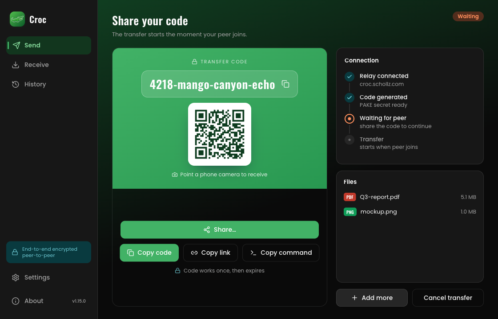
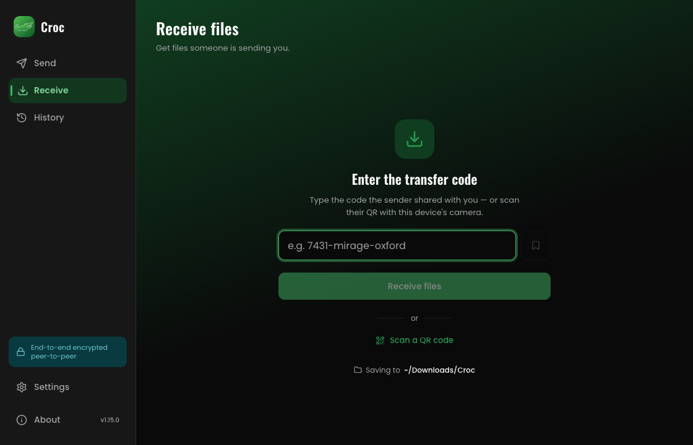
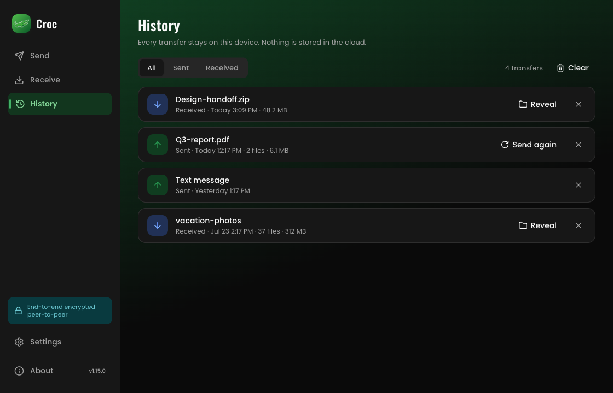
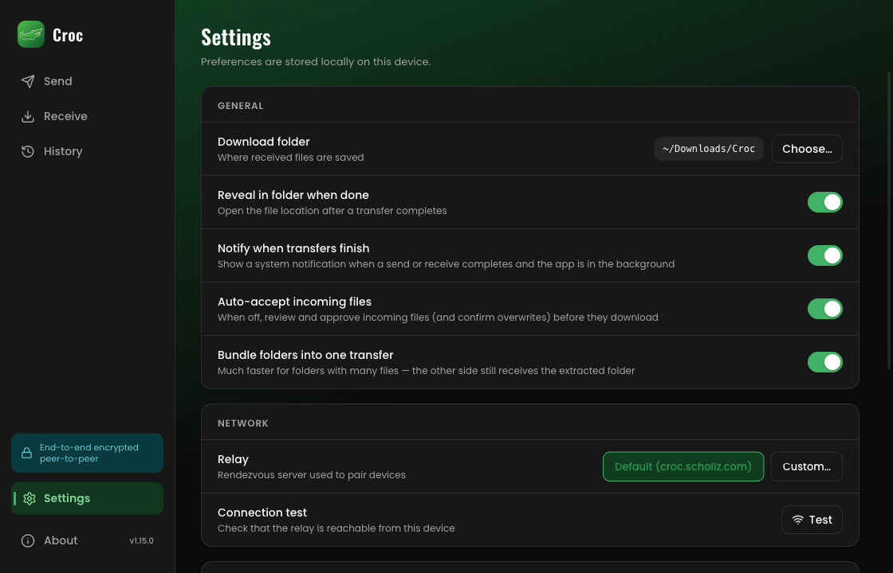
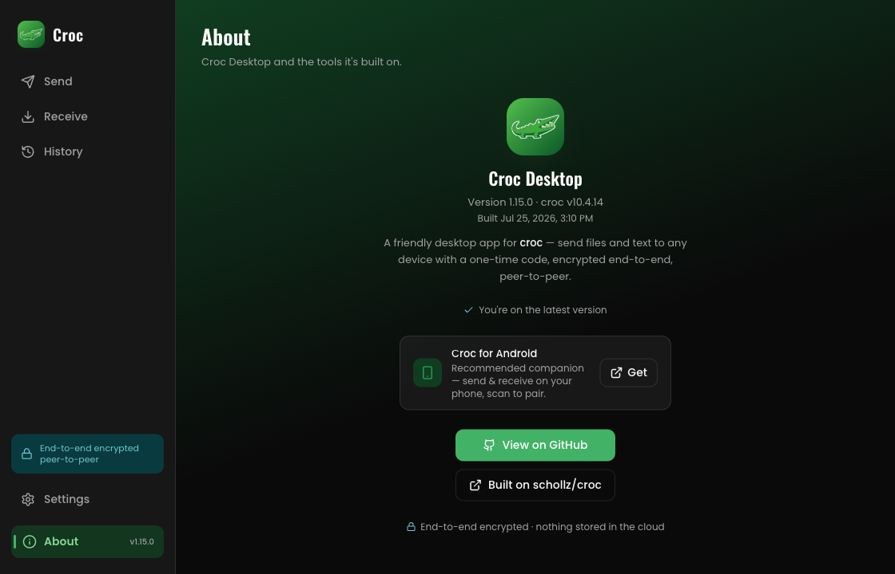

# Crocodile 🐊

*croc with a face.* **Croc Desktop** and **Croc Mobile** — a friendly, cross-platform GUI for [**croc**](https://github.com/schollz/croc), schollz's secure peer-to-peer file transfer tool. **macOS · Windows · Linux · Android**.

Drop in a file, folder, or some text → get a one-time code (and a QR) → share it. The other device enters the code and the transfer runs **end-to-end encrypted, straight between the two machines**. No account, no cloud storage, nothing kept on a server.

<p align="center">
  
</p>

## Features

- **Send files, folders, or text** — drag & drop, a file/folder picker, or paste (⌘/Ctrl-V) images, text, or copied files. On Android, share to Croc from any app.
- **One-time code + QR** — share the code, or let the peer scan the QR. The QR encodes a `croc://` deep link, so scanning it with a phone opens Croc straight into receiving.
- **Receive** — type or paste a code, or scan a QR with your camera. Auto-fills a code from the clipboard.
- **Live progress** on a per-file timeline, mirrored onto the Dock/taskbar.
- **Self-healing transfers** — a dropped transfer **auto-reconnects** (both ends retry the same code), and interrupted downloads **resume** from where they left off instead of restarting.
- **Auto-accept or review** incoming files, with notifications when a transfer finishes or needs you.
- **Transfer history** — re-send or reveal past transfers; nothing leaves the device.
- **Custom & bookmarked codes**, a relay picker + reachability test, and light/dark themes.
- **Deep links** — `croc://` and shareable `https://` links open the app straight into receiving.
- **Self-contained** — the correct `croc` binary is **bundled**, so there's nothing to install. Desktop **auto-updates** itself, signed.

## Screenshots

| Receive | History |
| --- | --- |
|  |  |

| Settings | About |
| --- | --- |
|  |  |

## Install

Grab the latest build from the [**Releases**](https://github.com/Carlos-err406/croc-gui/releases/latest) page:

- **macOS** — `.dmg` (universal). The app is not notarized, so on first launch right-click → **Open** (or *System Settings → Privacy & Security → Open Anyway*).
- **Windows** — `.exe` installer.
- **Linux** — `.AppImage` (portable) or `.deb`.
- **Android** — `croc-mobile-<version>-arm64.apk`. Sideload it: your phone will ask you to allow installs from your browser or file manager. Requires **Android 8+** on 64-bit ARM (`arm64-v8a`).

Desktop updates itself automatically from then on (toggleable in Settings). Android doesn't yet — watch the Releases page, or the repo.

## Croc Mobile

The Android build is the **same app**: same UI, same engine, same `croc://` code/QR contract — so phone ↔ desktop, phone ↔ phone and phone ↔ `croc` CLI all pair by scanning or typing a code.

What's different on a phone:

- **Files come in through the share sheet.** Share a photo, a document, or a link to **Croc Mobile** from anywhere and it lands on the Send screen, ready to go.
- **Received files are published to `Download/CrocMobile`**, so they show up in the Files app and the gallery like any other download. *(Android 10+; older releases keep them in app storage.)*
- **No folder sends, drag-drop, or "reveal in folder"** — Android's storage model gives apps document handles, not paths.
- **Transfers survive backgrounding.** A foreground service keeps the transfer alive when you switch apps or lock the phone, showing live progress in a notification that gives way to the finished/failed one at the end — verified on device with a 100 MB receive.

Previously this README recommended [croc-app](https://github.com/Dking08/croc-app) as the companion — a good project that showed a lot of this was possible. Croc Mobile supersedes it here.

## How it works

Neither app reimplements the croc protocol — both drive the real `croc` CLI and parse its output.

- **Two transports, one parser.** Desktop drives croc through a **pseudo-terminal** ([`portable-pty`](https://crates.io/crates/portable-pty)). Android has no pty available to an app, so it merges the child's stdout and stderr onto a **single pipe** and sets `COLUMNS=1000` so croc doesn't truncate filenames. Measured against croc v10.6.0 with no TTY anywhere: progress lines, peer lines, and interactive accept/overwrite/resume prompts all survive a plain pipe — which is why one regex parser serves both.
- The code phrase is generated app-side and passed via the `CROC_SECRET` env var (croc v10 refuses a code as a plain CLI arg), so there's no fragile stdout parsing for the code.
- Status/progress is parsed in Rust and **streamed to the UI over a Tauri event channel**, then rendered with the app's own progress timeline.
- The matching `croc` binary ships with the app — a **Tauri sidecar** on desktop, and on Android a `GOOS=android` build packaged as `libcroc.so` (the only place Android lets an app execute from). Both are preferred over any system `croc`.

[**docs/android.md**](docs/android.md) covers the Android port in detail: why croc is compiled rather than downloaded, how content URIs are staged, DNS, and what's verified on real hardware.

## Stack

- **[Tauri v2](https://tauri.app)** — Rust backend, native webview (no bundled Chromium)
- **React 18 + TypeScript**, **Vite**
- **Tailwind CSS v4** + **shadcn/ui** (new-york)
- Rust: `portable-pty` (pseudo-terminal), `os_pipe` (Android transport), `qrcode` (QR), `reqwest`, `jni` (Android storage); Tauri plugins for updater, deep-link, single-instance, notifications, dialog, opener

## Develop

Prerequisites: **Node.js**, **Rust** (stable), and the [Tauri v2 system prerequisites](https://tauri.app/start/prerequisites/) for your OS. The bundled `croc` binary is fetched automatically (`scripts/fetch-croc.mjs`) — no Go toolchain needed for the desktop build.

```bash
npm install
npm run dev        # Tauri dev: fetches croc, starts Vite + the app with HMR
```

Useful checks:

```bash
npm run typecheck  # tsc --noEmit
npm run build:vite # type-check + build the frontend only
```

For Android you also need the **Android SDK + NDK**, **JDK 17**, **Go 1.25+** (croc is compiled from source for `GOOS=android`) and `rustup target add aarch64-linux-android`:

```bash
npm run android:init   # tauri android init + scripts/android-configure.mjs
npm run android:dev    # or: npm run android:build
```

`src-tauri/gen/android/` is generated and git-ignored — customisations live in `scripts/android-configure.mjs`, so regenerating the project stays safe. See [docs/android.md](docs/android.md).

## Build

```bash
npm run build      # tauri build → .dmg / .exe / .AppImage / .deb for the current OS
```

Releases are cut by pushing a `v*` tag: CI builds and signs the desktop installers, the updater manifest, and the Android APK, then publishes them all to one GitHub release. **One version across every platform** — Android derives its `versionCode` from the semver, so a platform-specific version stream would produce duplicate codes and break updates.

## Contributing

Issues and PRs welcome — [CONTRIBUTING.md](CONTRIBUTING.md) covers setup, the checks CI
runs, and how to test a transfer by hand. Participation is under the
[Code of Conduct](CODE_OF_CONDUCT.md). Found a vulnerability? Please report it privately
per [SECURITY.md](SECURITY.md).

## Credits

Built on [schollz/croc](https://github.com/schollz/croc). Crocodile is an independent GUI and is not affiliated with the croc project.

## License

MIT — see [LICENSE](LICENSE).
